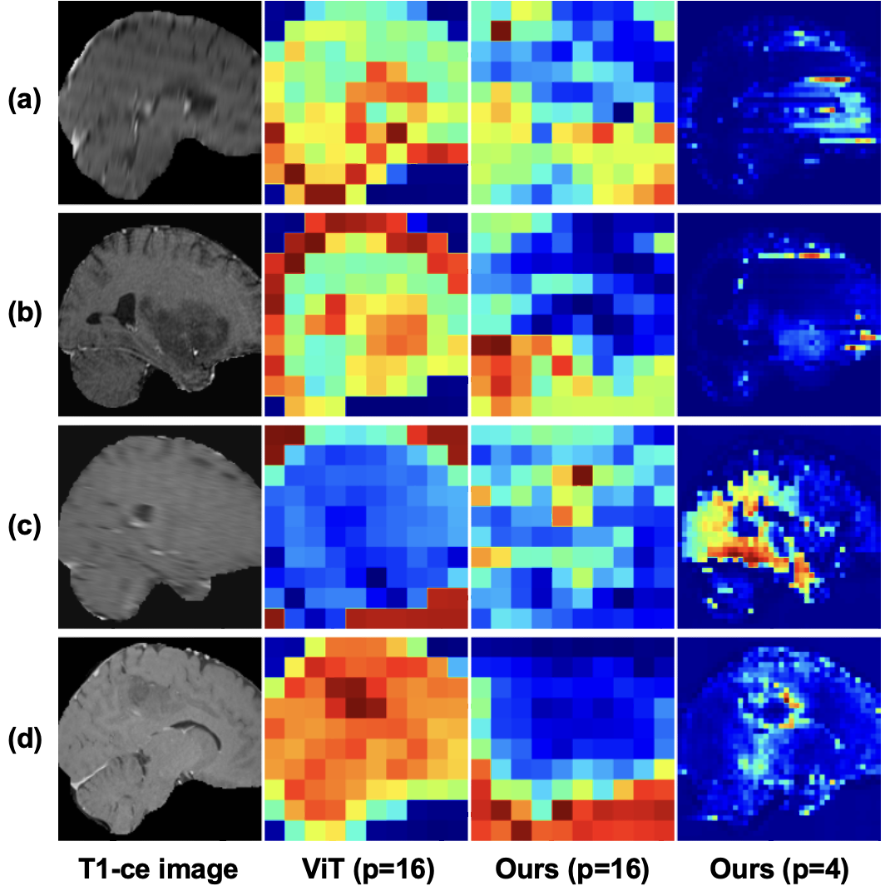

# mamba_mae_rebuttal

*Figure 2: The comparison of saliency maps between the vanilla ViT with a patch size 16 and our SSM-based models with patch sizes 16 and 4. (a) and (b) represent samples with IDH label 0 and 1,respectively; (c) and (b) represent samples with 1p/19q co-deletion label 0 and and 1, respectively.*
